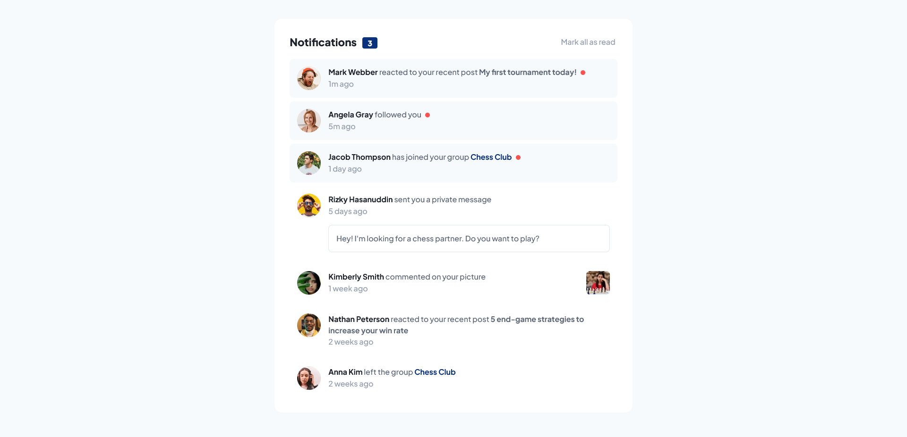

# Notifications page 👋

## [Notifications page](https://erictakman.github.io/notifications-page/)

## Overview

This challenge was to create an interactive notifications page where a user can see unread notifications and mark these as read, and get it to look as close to the design provided by Frontend Mentor as possible.

### The challenge

Users should be able to:

- Distinguish between "unread" and "read" notifications
- Select "Mark all as read" to toggle the visual state of the unread notifications and set the number of unread messages to zero
- View the optimal layout for the app depending on their device's screen size
- See hover states for all interactive elements on the page

## My process

Started out with thinking in terms of what components the page would consist of, then adding a few lines of HTML for referencing and base.

I added the provided colors and fonts to the css. Thereafter the text that was provided for the notifactions were refactored into the json file called "notifications", and the data was fetched from there. This way it could more easily be changed and manipulated for fututre use and redesigns of the page.

### Built with

- Semantic HTML5 markup
- CSS custom properties
- Flexbox
- CSS Grid
- Desktop/component first workflow

## Author

- Website - [Notifications page](https://erictakman.github.io/notifications-page/)
- Frontend Mentor - [@erictakman](https://www.frontendmentor.io/profile/erictakman)
- Twitter - [@EricTakman](https://www.twitter.com/EricTakman)

## Acknowledgments

Thanks to the Frontend Mentor for the challenge, and thanks to Josh Comeau for the css reset, check out his website [here](https://www.joshwcomeau.com/).